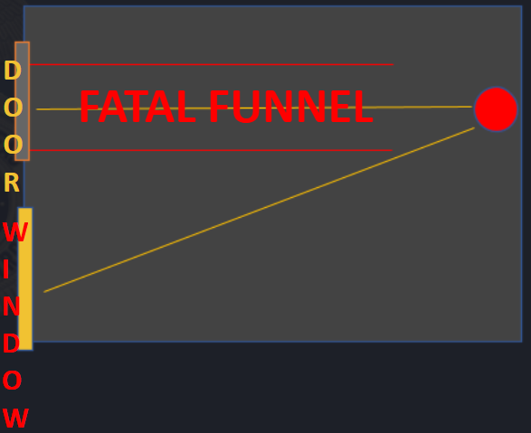

# Room Clearing/Entry

* At some point you will be called upon to clear a building or structure.
* Scene command needs to ensure the building is properly secured from the outside and all exits are being watched.
* Once a perimeter has been established, a team may be selected to make entry.
* <mark style="color:red;">**YOU**</mark> set the pace of the operation


Slow is smooth, smooth is fast.



Take your time.



Communicate.


***

Prior to making entry, it is important each member of the entry team knows their role, and more importantly that each is working together to cover a sector for the team.


**When Stacking**

Ensure you aren’t stacked on a window of the structure you intend to clear, as the individual inside may shoot at you.



**“Fatal Funnels”**

Every doorway, or choke point on a building is what is known as a fatal funnel, due to the ease and simplicity of firing through that chokepoint and the ability to pin down an entire team at that position. If you begin to take fire entering a doorway, <mark style="color:red;">**DO NOT**</mark> stop in the doorway.


<figure><figcaption>
Fatal Funnel
</figcaption></figure>

***

## Making Entry

The lead officer will push forward through the door, with the team in trail.

It is the lead officers choice as to which way he goes- but his first direction through the door will always be straight through and clear deep, in this particular instance the officer will pull right after visually clearing deep.


**DO NOT** stop in the fatal funnel, an initial breech or entry is meant to be fast.



Speed, Surprise and Violence of action wins gunfights.


<figure><figcaption>
Making Entry
</figcaption></figure>

***

As the number one officer comes through the door, the number 2 officer is right behind him, and will drive in the opposite direction, in this instance the number 2 will go left.

As the first 2 members breach, they will sweep from deep back center to their respective spot in the room, it is a swift technique meant to clear the room by 2 or more members and ensure the threat is detected quickly and can be engaged by other officers as they fill the room.

<figure><figcaption>
Entry
</figcaption></figure>

***

Once Officers 1 and 2 have swept and cleared their deep corners, focus should be brought back to the center of the room or the farthest portion.

If either officers detect a threat, they are still obligated to clear their respective deep corner. After verifying another threat does not exist in said corner, they shall bring focus back to an existing threat in the deep part of the room.

If a threat is detected in the deep part of the room, it should be called out via in game or RTO communication so the third and fourth individuals in the room know where the threat its, and they can engage as soon as they are through the door.


**THE PURPOSE OF CLEARING CORNERS**

Is for clearing a building when there is believed to be one or more individuals inside. If it is known that there is only one individual present- officers one and two should maintain focus on the threat and engage as necessary while clearing the fatal funnel zone for other officers to enter the door.



**DO NOT STAND IN THE FATAL FUNNEL!**


<figure><figcaption></figcaption></figure>
